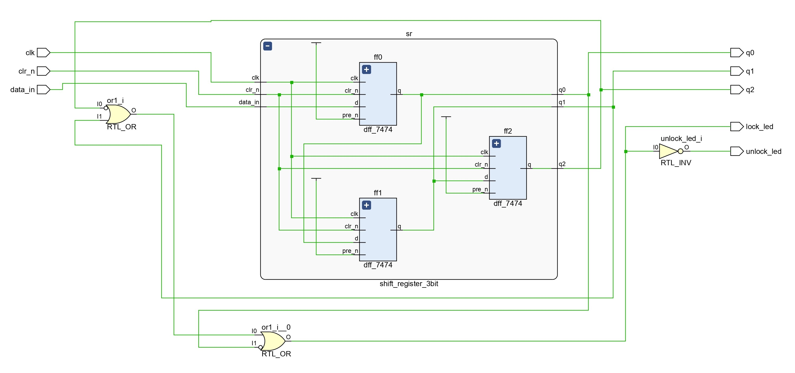
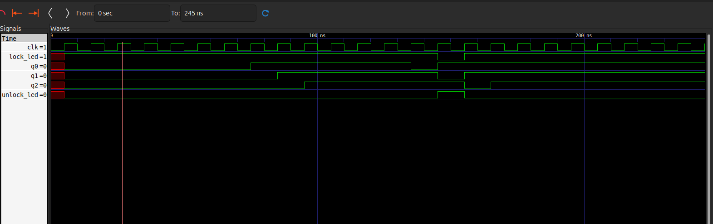

# 3-Bit Combinational Lock

This repository contains Verilog code for a 3-bit combinational lock implemented using D flip-flops and a simple logic gate. The lock unlocks when a specific 3-bit sequence (011) is entered. The lock status is indicated by `lock_led` (1 for locked, 0 for unlocked) and `unlock_led` (inverse of `lock_led`).

## Implementation

The lock is designed using a 3-bit shift register built from `dff_7474` modules (representing a D flip-flop with preset and clear). The output of the shift register is fed into a combinational logic circuit that checks for the unlock sequence.

### Modules:

- **`dff_7474`**: Models a D flip-flop with preset (`pre_n`) and clear (`clr_n`) inputs.
- **`shift_register_3bit`**: Implements a 3-bit shift register using three `dff_7474` instances.
- **`lock_control`**: Contains the shift register and the combinational logic to determine the lock state.
- **`combinational_lock_tb`**: Testbench module to verify the functionality of the lock.

## Usage

1. **Compilation:**

   ```bash
   iverilog -o cmblock cmblock.v
   ```

2. **Simulation:**

   ```bash
   vvp cmblock
   ```

3. **Waveform Viewing (GTKWave):**
   ```bash
   gtkwave cmblock.vcd
   ```

## RTL Schematic



## Simulation Output


